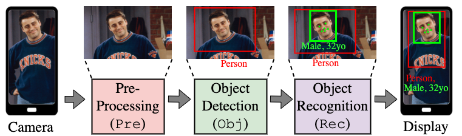
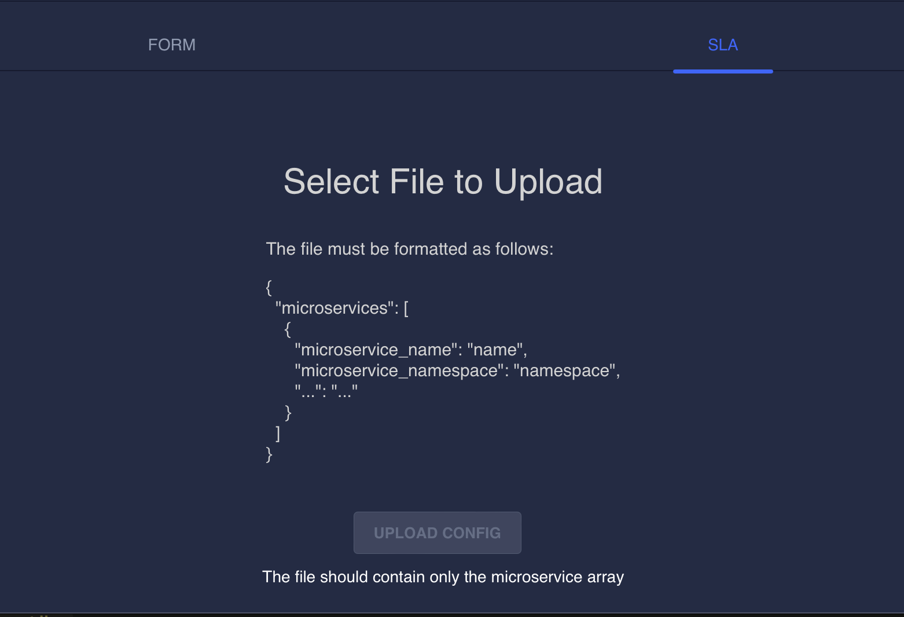
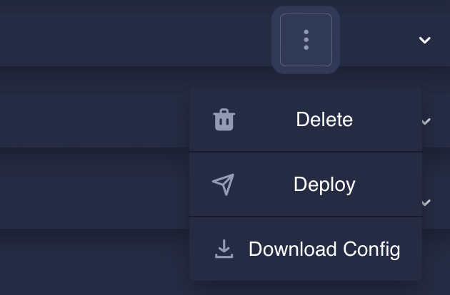
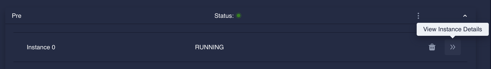

# Demo Pipeline:




This is an AR pipeline composed of 3 microservices. 

- Pre: preprocessing microservice, collects the frames and adapts them for the model. 
- Object Detection: detects the bounding boxes inside the image. If Object Recognition is up and running, it forwards the frames there. Otherwise, it sends the bounding boxes back to the client.  
- Object Recognitions: it receives the frames from object detection. For each bounding box of type "Person" it detects the face features and sends them back to the client. 

# How to deploy the pipeline using oakestra

Upload `sla.json` to Oak dashboard as follows:


### Step 1: Upload the SLA
Let's create a new service with:


And let's use the SLA panel to uploade our `sla.json` file



Select `sla.json` and hit the upload config button. 

### Step 2: Deploy Pre, Obj and Rec

Use the deploy button for each service, use click the deploy all button. 


The target machine will download and execute the images. This operation might take time.

### Step 3: Monitoring

When all services show the running status, check for the service details of Pre using the `Instance details` button.


Note down the `Node IP` address.

### Step 4: Run the client

0. Move to the machine you're willing to use as client, and make sure the `Node IP` from Step 3 can be reached from this machine. 

1. Clone and navigate to the `client` folder of this repository. 

2. Make sure you have a working installation of GoLang. Check it out using the command `go version`

3. Make sure you have OpenCV 4.5.5 installed on your machine

4. Install client dependencies with `go get -u`

5. Run your client with the following command. 
```
go run main.go -entry=<Node IP> -serverport=50100 -bbps=3 -latency=true
```

Replace `Node IP` with the one from Step 3. 

## Please note the following:

-----> The currently published images only work on **amd64** architectures! For arm devices please build your own images. 

-----> Recognition is a very heavyweight service. The current image does not exploit cuda capabilities. If your hardware is not bulky enough try first only deploying pre and obj 


